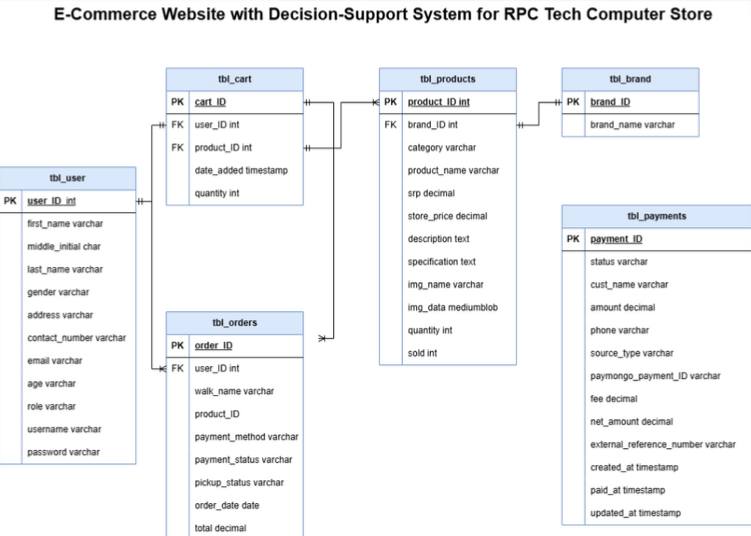

# E-Commerce Website with Decision Support System

This is an E-Commerce Website with a Decision Support System, built to help users select compatible computer parts based on their preferences (e.g., budget, usage). The website allows customers to purchase desktop hardware and peripherals from RPC Tech Computer Store with secure payment integration using Paymongo.

## Features

- User registration and login (including role-based access for customers and admin)
- Product catalog with filters (by category, brand, price range, etc.)
- Decision Support System to help users choose compatible computer parts
- Secure payment via PayMongo and Cash On Delivery (COD)
- Order tracking and management
- Admin dashboard for managing orders, products, and customers
- Real-time availability tracking of products
- Reports and analytics on sales and customer data

## Tech Stack

- **Frontend**: 
  - HTML, CSS, JavaScript (ES6+)
  - [Bootstrap](https://getbootstrap.com/) for responsive design
  - [jQuery](https://jquery.com/) for DOM manipulation
- **Backend**:
  - PHP for server-side logic
  - [PayMongo](https://www.paymongo.com) API for payment integration
- **Database**: 
  - MySQL for database management
  - [HeidiSQL](https://www.heidisql.com/) for remote database management and access
- **Other Tools**:
  - [Composer](https://getcomposer.org/) for PHP dependency management
  - [Apache](https://httpd.apache.org/) or [XAMPP](https://www.apachefriends.org/index.html) for local server setup

## Design Prototype

A live, interactive prototype of the website was created using Figma to provide a realistic user experience with working links and navigation. 

- View the prototype in [Figma](https://www.figma.com/design/oZP1HryJzSm8Dqhd2I4RLX/RPC-COMPUTER-STORE-UI?t=2Di5GvDJQR6tM7ah-1)

## Database Schema

## License

This project is licensed under the MIT License.

Copyright (c) 2024 John Kenny Reyes, Danel Tungpalan, Ian Ronneil Dadul, Joshua Miguel Timado, Tracy McJayryl Veloria, Christ Paul P. Gerona

